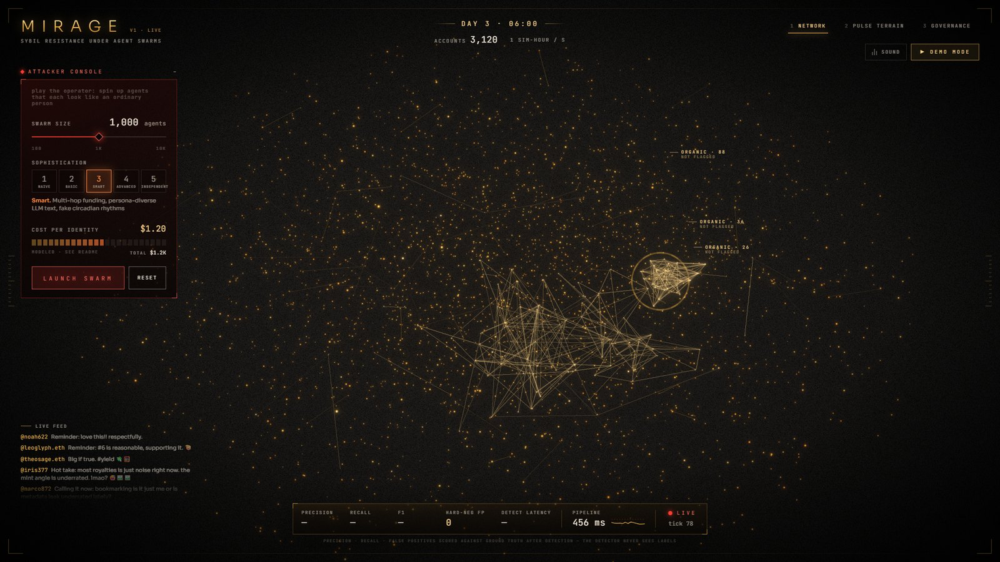

# MIRAGE: the 3-minute demo



Everything on screen is the real pipeline running live. Demo Mode only issues
commands (reset, launch, switch view, open evidence) and then **waits for the
detector** to deliver. Nothing is pre-recorded or animated from a script.

## Before you go on

```bash
npm run dev          # chain + contract + backend + web, ~40 s
```

1. Open `http://localhost:3000` and go full screen (F11).
2. Wait for the **LIVE** dot in the metrics strip (the backend warms up a 3-day world first).
3. Press **M** for sound. It's subtle: a low hum, a riser while a target is being acquired, a lock click.
4. Press **D** to start Demo Mode (~85 s). Esc stops it and **D** restarts it from a fresh, identical world.

If anything looks off, press **D** again. It resets to the same seeded world every time.

## The pitch (3:00)

| time | on screen | say |
| --- | --- | --- |
| **0:00** | the calm gold network | "Every DAO treasury vote assumes one account is one person. AI agents broke that: each one writes fluently, keeps a believable schedule and passes any check you can run on a single account. So we stopped looking at accounts." |
| **0:20** | press **D** · *MIRAGE* title | "MIRAGE looks at what an operator can't cheaply fake: independence." |
| **0:25** | *3,000 people. Each one independent.* | "Every gold point is a simulated person with their own rhythm, interests, money and voice. The tagged clusters are real communities we built to look like swarms: a club that shows up together, friends who fund each other, a working group that votes as a bloc. MIRAGE marks them **organic, not flagged**." |
| **0:40** | *An operator launches 1,000 AI agents.* | "Level three: multi-hop funding, persona-diverse LLM text, fake circadian rhythms. $1.20 per identity. Nothing on the map looks wrong." |
| **0:50** | ring locks · *Together, they're a mirage.* | "Here's the lock. The detector sees only public data: posts, follows, transfers and votes, never a label. It caught them a few simulated hours after launch, confidence 0.99, and the count keeps climbing as the rest of the swarm arrives." |
| **1:00** | evidence panel | Read two lines, e.g. "983 accounts trace their funding to 3 wallets within 4 hops" and "writing fingerprint 0.72 against a baseline of 0.16". "Every flag comes with numbers a human can check: one budget, one generator, one clock." |
| **1:15** | Pulse Terrain | "Real people make gentle waves: sleep, work, evenings. One operator makes synchronized ridges." |
| **1:25** | Governance · *the swarm wins* | "The proposal sends the treasury to the attacker. One account, one vote: it passes." |
| **1:30** | the flip | "Correlation-weighted, a flagged cluster of n accounts carries a total weight of 1. A thousand puppets are one voice, and the honest result wins. This isn't a mock-up: the tallies are computed by the MirageGovernance contract on a local chain, from signed votes and oracle-attested clusters." |
| **1:45** | Level 5 launch · *Detection fades* | "Now the honest part. Level five pays for independence: separate budgets, separate generators, no shared triggers. We don't catch it, and we say so on screen: 0% flagged." |
| **1:55** | the cost line | "But look at the price. $48 per identity instead of $1.20. Ten thousand level-3 agents cost $12k; ten thousand independent ones cost $480k." |
| **2:05** | end card | **"Faking one person is cheap. Faking ten thousand independent people isn't."** |
| **2:10** | (free play) | Launch a level-1 swarm from the attacker console: it locks almost instantly. Launch level 4 and show sleeper accounts still get caught by lifecycle and vote lockstep. Open **governance → ln n** if asked about softer weighting. |
| **2:40** | close | "MIRAGE doesn't ban anyone and doesn't need identity documents. It makes scale expensive: the only advantage a swarm has is numbers, and we take the numbers away." |

## Judge Q&A

**Is this live or scripted?**
Live. The backend simulates the network tick by tick and runs the full
detection pipeline every simulated hour, in under a second.
Demo Mode waits on real events: `waitFor(lockedCluster !== null)`. The
precision and recall strip is scored against ground truth *after* each run.
The detector never sees labels, and four tests enforce that (`backend/tests/test_label_leak.py`).

**What about false positives on real communities?**
That is the design constraint. The world contains three hard-negative
communities built to trip naive detectors: shared events, shared funding,
bloc voting. A SWARM verdict needs two strong, independent signal families,
one of them behavioural (what accounts *do*) and one a coordination family
(a shared clock, funder, vote, reflex or lifecycle). People with similar tastes
share topics and styles by accident. They don't share a funder *and* a
trigger. Result: **0 hard-negative false positives** at every swarm level in
the sweep, and through a quiet simulated week on a second seed. And because
MIRAGE *re-weights* rather than bans, a mistake costs a community its vote
multiplier, not its voice.

**What if attackers adapt?**
They do: that's what levels 2–5 are. Every adaptation costs money: aged
sleeper accounts, per-identity funding paths, separate generators, humans on
schedules. Level 4 (sleepers with real-user timing) is still caught by
lifecycle, funding bursts and vote lockstep. Level 5 is not, and the UI says
so. The claim isn't "we catch everything". The claim is that independence
has a price, and MIRAGE makes the operator pay it for every single identity.

**Why not proof of personhood?**
It's complementary. Proof of personhood stops fake *registrations*, but not
real or rented identities acting in coordination, and it can't be applied
retroactively to pseudonymous DAOs that already hold treasuries. MIRAGE needs
no documents, works on public behaviour, and changes vote weight, not access.

**Who runs the oracle? Isn't that centralised?**
In this prototype, one oracle key attests cluster memberships in epochs.
It's a trust assumption and the README says so. The path out:

- several independent detectors, each replaying the same public data deterministically;
- t-of-n threshold signatures on each attestation;
- a dispute window before an epoch finalizes;
- published per-cluster evidence, so anyone can audit a flag.

**Why weight instead of ban?**
Bans are brittle and punish false positives absolutely. Weighting bounds the
damage in both directions: a misjudged community still votes as one voice,
and a swarm keeps its accounts but loses its only advantage, numbers. `ln n`
mode is available for an even softer curve: 1,000 accounts count as about 6.9.

**How fast is it?**
The whole pipeline (ingest, embeddings, six signals, kNN, fusion, Leiden,
scoring and evidence) runs in about 0.6 s at 5k accounts, and about 0.8 s at
the median with a 1,000-agent swarm on top (`python -m mirage.cli bench`).
In the live app a level-3 swarm is locked within a few simulated hours, and
half of it is flagged about 6 hours after launch. Level 1 takes about 2.

**What is simulated and what is real?**
Simulated: the accounts, their posts (templated, or an optional pre-generated
LLM cache), follows and the money ledger. Real: the detection pipeline, the
MiniLM embeddings, the Solidity contract, the per-account EIP-191 vote
signatures, the oracle transactions and the on-chain tallies on a local
Hardhat chain.

**Could this be used for censorship?**
It removes nothing. It only changes how much a correlated group's votes
count in one governance decision, with the evidence published next to the
number.
