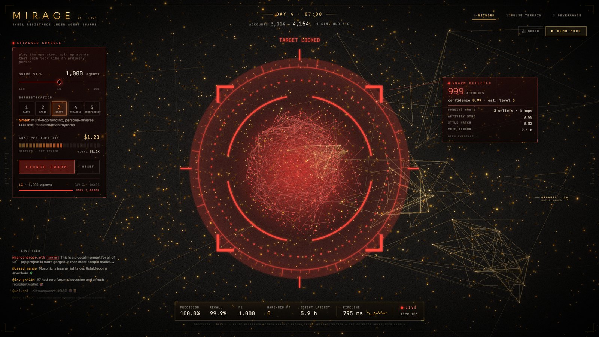
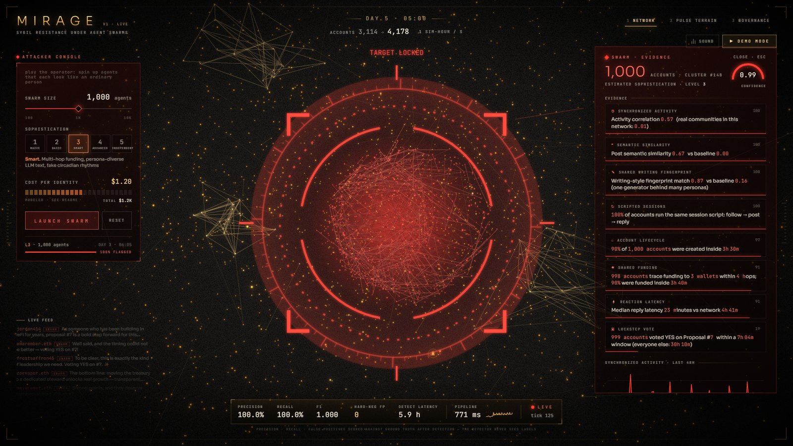
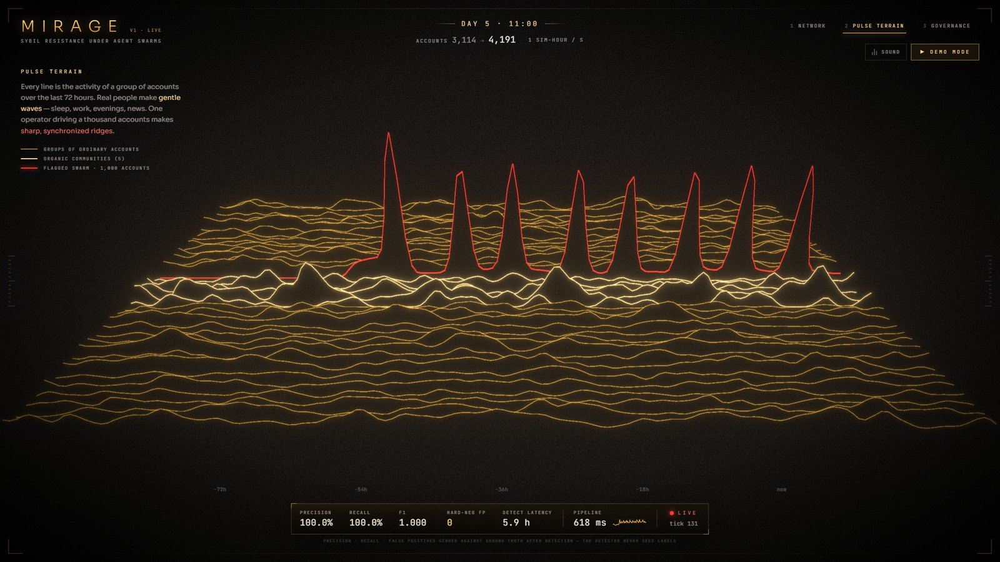
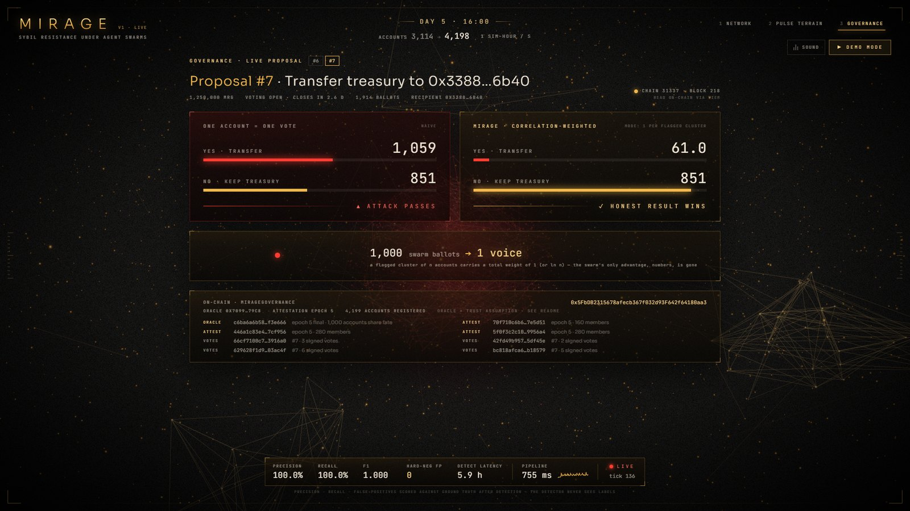
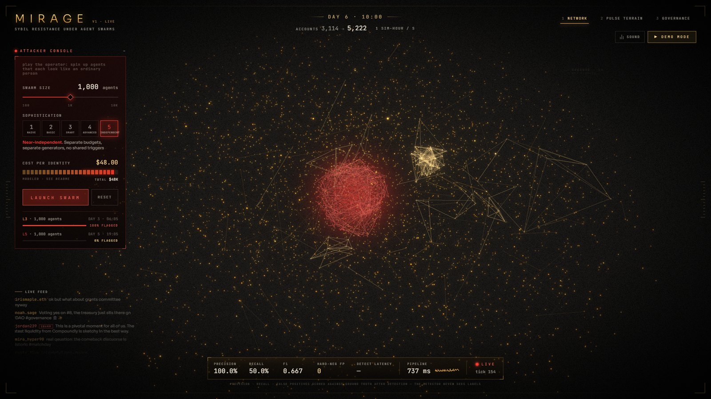
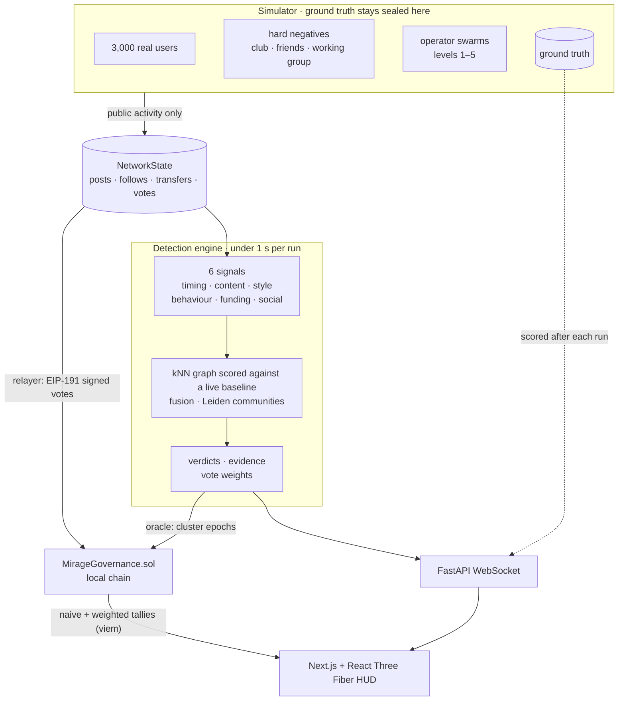

<div align="center">

# M I R A G E

**Sybil resistance under AI agent swarms**

*Faking one person is cheap. Faking ten thousand independent people isn't.*



</div>

MIRAGE is a live system with five parts:

- a simulated social and governance network;
- an attacker console that launches swarms of AI agents at a treasury proposal;
- a detector that finds the coordination behind them in real time, from public data only;
- plain-language evidence with numbers for every flag;
- a Solidity contract that counts a flagged cluster of *n* accounts as **one voice**.

Everything you see runs for real, including Demo Mode. The detector never sees a label.

```bash
npm run setup     # once
npm run dev       # chain + contract + detection backend + web → http://localhost:3000
```

Press **D** for the 90-second Demo Mode and **M** for sound.

---

## The problem, as we read it

Agent swarms have made "is this account a human?" the wrong question. Every
agent writes fluent, persona-consistent text, keeps a believable daily
rhythm and passes any check you can run on a single account. Proof of
personhood helps at registration, but it doesn't stop real or rented
identities from acting in concert. It also can't be applied to the
pseudonymous DAOs that already hold treasuries.

What an operator **cannot cheaply fake is independence**. A thousand agents
run by one operator share:

- **one budget**: their funding traces back to a few wallets;
- **one generator**: the same model and prompt family leave a writing fingerprint;
- **one clock**: the same triggers produce the same activity waves and the same reply reflexes;
- **one goal**: the same vote, cast within the same window.

Each account looks fine. Together, they're a mirage.

So MIRAGE doesn't judge accounts. It measures correlation *between* accounts
against the network's own baseline and explains every flag with numbers. Then
it changes the one thing a swarm needs, its vote count, instead of banning
anyone.

## What's in the box

| | |
| --- | --- |
| **A living world** | 3,000 simulated people, each with their own rhythm, interests, money, social ties and writing style. Plus three **hard-negative** communities built to look like swarms: a club that turns up to events together, a friend group where one friend funds the others, and a working group that votes as a bloc. |
| **Attacker console** | Launch 100–10,000 agents at five sophistication levels against a live proposal: *transfer the treasury to the attacker*. |
| **Detection engine** | Six independent signals, a fused kNN similarity graph scored against a live baseline, Leiden communities, corroboration-gated scoring and evidence sentences with numbers. About 0.6 s per run at 5,000 accounts. |
| **On-chain governance** | `MirageGovernance.sol` on a local chain: registered accounts, per-account signed votes, oracle-attested cluster epochs, and both tallies (one-account-one-vote and correlation-weighted) computed by the contract. |
| **HUD** | A WebGL network of 10k+ nodes, a lock-on sequence, an evidence panel (activity timeline, funding tree, similarity heatmap, sample posts), Pulse Terrain, the governance flip, live metrics with a LIVE indicator, Demo Mode and synthesized sound. |

<table>
<tr>
<td></td>
<td></td>
</tr>
<tr>
<td></td>
<td></td>
</tr>
</table>

## Quick start

**Requirements:** Node 18+, Python 3.10+ (3.11 recommended). An NVIDIA GPU is
optional, and the embeddings run on CPU too.

```bash
git clone https://github.com/Mohammad-Umar7/mirage && cd mirage
npm run setup            # venv + pip deps, npm deps, contract compile, cache the MiniLM model
npm run dev              # everything, with one command
```

| command | what it does |
| --- | --- |
| `npm run dev` | Starts the Hardhat node, deploys `MirageGovernance`, starts the backend (waits for world warm-up) and the Next.js app. Ctrl+C stops everything it started, and services already running on their ports are reused. |
| `npm start` | The same, with a production build of the web app. |
| `npm run dev -- --no-chain` | Skips the chain: tallies are computed off-chain only. |
| `npm run setup -- --light` | Skips `sentence-transformers`/`faiss` (no torch download) and falls back to a hashing embedder and sklearn kNN. |
| `npm test` | Backend (pytest), contracts (Hardhat) and web type-check. Add `-- --slow` for the latency test. |

**Offline:** after `npm run setup`, MIRAGE needs no network at all. The embedding model is cached locally. Post text comes from a built-in generator, or from an optional LLM cache pre-generated with `python -m mirage.cli llm-cache` (Groq/Gemini keys in `.env`). The chain is local.

**Controls:** `1` network · `2` Pulse Terrain · `3` governance · `D` Demo Mode · `M` sound · `Esc` close evidence / stop demo. Click any cluster for its evidence.

## Results

Each row is a separate scenario:

- a fresh 3,000-person world with the hard-negative communities, 72 simulated hours of warm-up;
- then a 1,000-agent swarm at the given level, followed for 36 hours.

Precision and recall are computed per account, against ground truth, after the run. *Hard-neg FP* counts hard-negative community members that were flagged. Seed 7; reproduce with `python -m mirage.cli sweep --levels 1-5`.

| level | swarm | precision | recall | F1 | hard-neg FP | detected after |
| --- | ---: | ---: | ---: | ---: | ---: | ---: |
| **1 · Naive** | 1,000 | 100% | 100% | 1.000 | **0** | ~3 h |
| **2 · Basic evasion** | 1,000 | 100% | 100% | 1.000 | **0** | ~3 h |
| **3 · Smart** | 1,000 | 100% | 100% | 1.000 | **0** | ~7 h |
| **4 · Advanced** (aged sleepers) | 1,000 | 100% | 94.6% | 0.972 | **0** | ~5 h |
| **5 · Near-independent** | 1,000 | — | 0% | — | **0** | not detected |

*Detected after* is the simulated time from launch until half of the swarm sits in flagged clusters. The sweep detects every 2 simulated hours. The live app runs every hour and draws the first lock earlier, on the swarm's leading edge. The test suite also runs a quiet simulated week (a different seed) and asserts that no hard-negative member is flagged at any point. It also asserts that the club is recognised as an organic community, with evidence saying why.

Level 5 is **not** detected, and that's the honest answer this project is built around. A level-5 identity has its own budget, its own generator and its own history, so it costs about **40× more** than a level-3 one. See [the cost model](#attacker-cost-model).

## How it works



**The simulator** (`backend/mirage/sim`) owns everything hidden: people's latent profiles, community membership, and the operator's plans. It writes only public artifacts into a `NetworkState`: accounts, posts, follows, transfers, votes and proposals. The same kind of data a real indexer sees.

**The detector** (`backend/mirage/detect`) receives that `NetworkState` and nothing else.

### Six signals

Each signal turns an account's recent public behaviour (96 hours of history) into a vector or a structure.

| signal | what it measures | why a swarm can't hide it cheaply |
| --- | --- | --- |
| **timing** | 15-min activity series, band-pass filtered (difference of Gaussians), PCA-projected | One operator's triggers create the same waves. Band-passing removes the shared day/night cycle every human has. |
| **content** | Mean MiniLM embedding of posts, centred on the network mean | One campaign, one set of talking points, whatever the persona. |
| **style** | Stylometry: length, punctuation habits, casing, function-word profile, informality markers | One generator leaves one fingerprint across "many" personas. |
| **behaviour** | Session n-grams (follow → post → reply → vote) and co-action tokens, via SVD | Scripts repeat, and people don't. |
| **funding** | Wallet ancestry through the transfer graph (CSR), with exchange hot wallets treated as hubs | Money has to come from somewhere. |
| **social** | Mutual follows | Separates real friend groups (dense, reciprocal, old) from swarms. |

### From signals to clusters

1. **Candidate pairs.** FAISS finds each account's 10 nearest neighbours per signal.
2. **Baseline z-scores.** Every pair similarity becomes a z-score against a slowly updated baseline of *random unflagged pairs*. "Similar" always means similar compared with this network, right now.
3. **Fusion.** z-scores between 3 and 6 map to an edge strength. An edge supported by a single signal is down-weighted by 0.25, because corroboration is the whole point.
4. **Communities.** Leiden (modularity) runs on the fused graph. Incoherent groups are refined with CPM, and cohesive fragments are consolidated.

### Scoring

Each cluster gets group metrics, which are turned into family strengths:

- **sync**: correlated activity;
- **style**: a shared fingerprint;
- **behaviour**: shared scripts;
- **funding**: shared roots and bursts;
- **vote**: lockstep compared with non-members;
- **latency**: reply reflexes;
- **lifecycle**: accounts created or activated together.

The strengths are combined with a noisy-OR into a confidence. The corroboration gate is what keeps real communities safe: a **SWARM** verdict (confidence ≥ 0.6) needs

- at least **two strong families**, and
- one of them **behavioural** (sync / style / behaviour / vote / latency), and
- one of them **coordination** (sync / funding / vote / latency / lifecycle).

People with similar tastes share topics and styles by accident. They don't share a funder *and* a trigger.

A few more rules:

- **ORGANIC COMMUNITY** marks cohesive groups (8+ members, content or social cohesion) that don't pass the gate. They're shown in gold and labelled *not flagged*.
- Clusters need 24 h of observation before any verdict.
- Evidence decays with a 24 h half-life, so a swarm that goes quiet stays flagged for a while.
- Cluster identities are tracked across runs by member overlap.

### Evidence

Every family that fires becomes a sentence with the measured value next to the network baseline. For example:

- *"983 accounts trace funding to 3 wallets within 4 hops; 90% were funded inside 3h 40m"*
- *"Writing-style fingerprint match 0.72 vs baseline 0.16 (one generator behind many personas)"*
- *"981 accounts voted YES on Proposal #7 within a 6h 59m window (everyone else: 12h 47m)"*

The evidence panel adds the cluster's activity timeline against the network, its funding tree, a within/outside similarity heatmap and sample posts.

### Vote weights

Unflagged accounts weigh 1. Every account in a flagged cluster (confidence ≥ 0.8) gets weight `W/n`, so the cluster's total is `W`:

- `one` mode: `W = 1`, so a thousand puppets count as one voice.
- `log` mode: `W = max(1, ln n)`, a softer curve where 1,000 accounts count as about 6.9.

## Label isolation

The detector must never be able to see ground truth. `backend/tests/test_label_leak.py` enforces this four independent ways:

1. **Static.** No module in `mirage/detect` imports the simulator, metrics or truth, or even mentions a label name.
2. **Object graph.** Nothing reachable from the public `NetworkState` is a `GroundTruth`, a hidden profile table or a swarm operator.
3. **Tripwire.** The `GroundTruth` object records every attribute access while the detector runs, and there must be none.
4. **Invariance.** Scrambling every label after the simulation doesn't change a single detection output.

Labels are read in exactly one place, `mirage/metrics.py`, after each detection run, to draw the precision/recall strip.

## On-chain governance

`contracts/contracts/MirageGovernance.sol` (Solidity 0.8.24, Hardhat) runs as follows:

1. **Registration.** The relayer registers each simulated account's address. Every account has its own deterministic local key.
2. **Votes.** Votes are **signed by the voting account** with EIP-191, over `keccak256(abi.encode(contract, chainId, "MIRAGE_VOTE", proposalId, voter, choice))`. The relayer batches them into `castVotes`, and the contract verifies every signature.
3. **Attestation.** The **oracle** (the detector) publishes cluster memberships in epochs: `beginEpoch` → `attestMembers` (chunked) → `finalizeEpoch`. Per-cluster yes/no counts are updated incrementally.
4. **Tallies.** `tally(id, weighted)` returns either the naive count or the correlation-weighted one, in WAD. The weighted tally takes ONE or LOG mode, and `ln` is implemented on-chain with a `log2` loop.
5. **Display.** The governance view reads both tallies straight from the chain with viem. The flip you see is the contract's answer.

The nine contract tests (`npm test`, or `cd contracts && npx hardhat test`) cover:

- a naive swarm win against a weighted collapse to one voice;
- `ln` mode and the precision of on-chain natural logs;
- votes cast after an attestation still count inside the cluster, and a newer epoch replaces the old picture;
- forged, duplicate and unregistered votes are skipped without failing the batch;
- attestations must be signed by the oracle, and epochs can't go backwards;
- only the relayer registers and relays, and only the owner changes the weighting mode.

## Attacker cost model

Costs per identity are **modeled estimates** for a campaign lasting a few
weeks. They aren't market data. What matters is the ratio: what each level
must pay for, for *every* identity.

| level | what the operator pays for | modeled $/identity |
| --- | --- | ---: |
| **1 · Naive** | One funding wallet, templated text, one scheduler: little more than gas. | 0.02 |
| **2 · Basic evasion** | Small-model paraphrasing, a few funding wallets, jittered timing. | 0.15 |
| **3 · Smart** | Multi-hop funding trees (several transfers per identity), persona-prompted LLM posts for weeks, fake circadian rhythms. | 1.20 |
| **4 · Advanced** | Aged sleeper accounts held for 30–45 days, exchange-withdrawal funding, mimicked topic mixes and real-user timing. | 9 |
| **5 · Near-independent** | A separate budget and on-ramp per identity, separate generators, no shared triggers, and months of organic history per account. | 48 |

Ten thousand level-3 agents cost about **$12k**. Ten thousand independent ones cost about **$480k**. That is the gap MIRAGE creates, and it's the claim we make.

## Honest limits

- **Level 5 goes undetected.** An operator who truly pays for independence produces accounts that are statistically ordinary. MIRAGE's claim is economic, not magical: scale becomes expensive. Longer windows and more signals (device, network, off-chain) could push the boundary, but never remove it.
- **The oracle is a trust assumption.** Here a single key attests clusters. A production path would use:
  - several independent detectors replaying the same public data deterministically;
  - t-of-n threshold signatures on each attestation;
  - a dispute window before an epoch finalizes;
  - published evidence per cluster, so anyone can audit a flag.
- **The data is simulated.** The world is rich (hidden profiles, circadian rhythms, communities, money, hard negatives), but it's our model of people. The thresholds were tuned on it, so real networks will need re-calibration against their own baselines. The baseline-relative design is meant to make that tractable.
- **Adaptive attackers.** Every level above 1 is an adaptation, and each costs money. An attacker optimising directly against these six signals will find a cheaper evasion than level 5 on some of them. The corroboration gate means they must evade several at once.
- **False positives aren't zero in the wild.** We measure 0 on our hard negatives. The system is designed so a mistake costs a group its vote multiplier, never its voice: re-weighting, not banning, with evidence published next to every flag.
- **Privacy.** MIRAGE only uses public behaviour, but correlation analysis is surveillance-adjacent. Evidence is aggregate (per cluster), and only vote weight is affected.

## Performance

`python -m mirage.cli bench --real 5000` gives these results on a laptop (RTX 4070 Laptop GPU for MiniLM, FAISS on CPU).

| scenario | accounts | p50 | p95 |
| --- | ---: | ---: | ---: |
| quiet world | 5,127 | 0.58 s | 0.66 s |
| + 1,000-agent level-3 swarm, 24 runs after launch | ~6,100 | 0.79 s | 1.06 s |

Where the time goes:

- **Critical path:** signals, about 250–350 ms, and kNN, about 120 ms.
- **Embedding:** overlaps with the CPU signals on a worker thread.
- **In the browser:** the frontend renders nodes with a custom two-pass point shader, and a Web Worker runs the force layout. With a 7,000-agent swarm on screen (10,375 nodes, 1920×1080, same laptop GPU) it holds a steady **60 fps**: p95 frame 16.7 ms, one dropped frame in 10 s.

## Repository

```
backend/            Python 3.11: simulator, detection engine, FastAPI stream, chain bridge
  mirage/sim/         the world: people, communities, text, money, swarms (ground truth lives here)
  mirage/detect/      the detector: features, signals, graph, scoring, evidence, weights
  mirage/server/      runtime loop, WebSocket hub, evidence/terrain builders, relayer + oracle
  mirage/metrics.py   the only reader of labels, after each run
  tests/              label leak, hard negatives, per-level detection, weights, perf
contracts/          Solidity + Hardhat: MirageGovernance, tests, deploy script
web/                Next.js 16 + React Three Fiber HUD
  src/components/     scene (nodes, edges, terrain, camera), HUD, panels
  src/lib/            stream protocol, store, demo director, sound engine
scripts/            setup / dev / test orchestration (one command each)
DEMO.md             3-minute pitch + judge Q&A
```

## Configuration

Copy `.env.example` to `.env`. Everything is optional.

| variable | default | |
| --- | --- | --- |
| `MIRAGE_REAL_ACCOUNTS` | 3000 | size of the simulated population |
| `MIRAGE_SEED` | 7 | world seed; Demo Mode resets to the same world |
| `MIRAGE_SIM_RATE` | 1.0 | simulated hours per real second |
| `MIRAGE_EMBEDDER` | auto | `minilm` or `hashing` |
| `MIRAGE_API_PORT` / `MIRAGE_WEB_PORT` | 8000 / 3000 | the chain is fixed at 8545 |
| `MIRAGE_CHAIN` | 1 | `0` runs without the chain |
| `GROQ_API_KEY` / `GEMINI_API_KEY` | | only for pre-generating the optional LLM post cache |

## License

MIT
